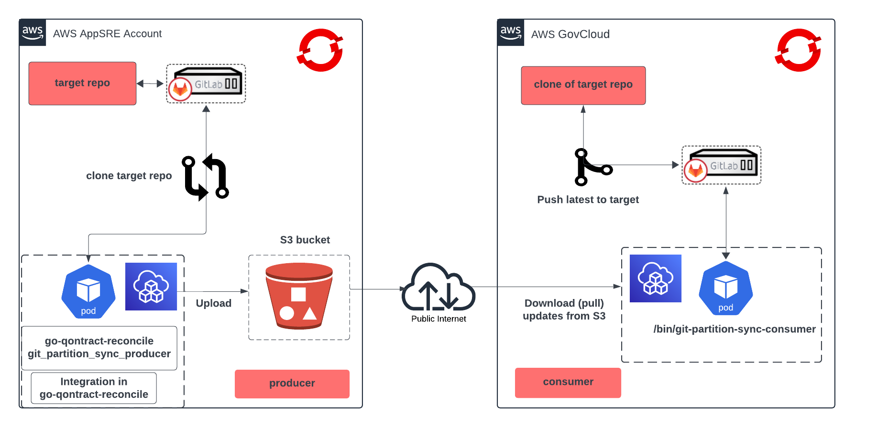

# Git Partition Sync - Producer

Uploads an encrypted archive of latest versions of target GitLab projects to s3 bucket.  
This works in tandem with [git-partition-sync-consumer](https://github.com/app-sre/git-partition-sync-consumer) to sync GitLab instances in isolated environments.
Utilizes the AWS SDK to communicate to the desired s3 buckets.

[age](https://github.com/FiloSottile/age) x25519 format keys are utilized.



## Uploaded s3 Object Key Format
Uploaded keys are base64 encoded. Decoded, the key is a json string with following structure:
```
{
  "group":string,
  "project_name":string,
  "commit_sha":string,
  "local_branch":string,
  "remote_branch":string
}
```
**Note:** the values within each json object will mirror values for each `destination` defined within config file 
(exluding `commit_sha` which is the latest commit pulled from `source`)
